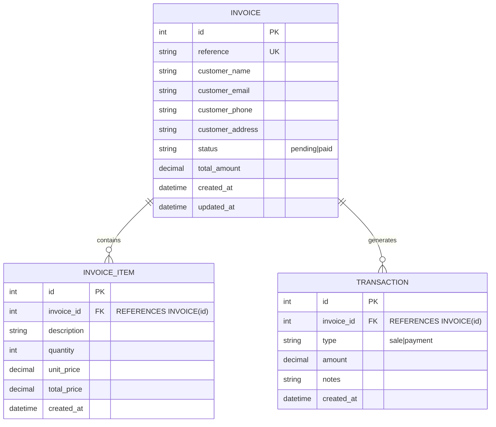

```mermaid
erDiagram
    INVOICE ||--o{ INVOICE_ITEM : contains
    INVOICE ||--o{ TRANSACTION : generates
    
    
    INVOICE {
        int id PK
        string reference UK
        string customer_name
        string customer_email
        string customer_phone
        string customer_address
        string status "pending|paid"
        decimal total_amount
        datetime created_at
        datetime updated_at
    }
    
    INVOICE_ITEM {
        int id PK
        int invoice_id FK "REFERENCES INVOICE(id)"
        string description
        int quantity
        decimal unit_price
        decimal total_price
        datetime created_at
    }
    
    TRANSACTION {
        int id PK
        int invoice_id FK "REFERENCES INVOICE(id)"
        string type "sale|payment"
        decimal amount
        string notes
        datetime created_at
    }
```