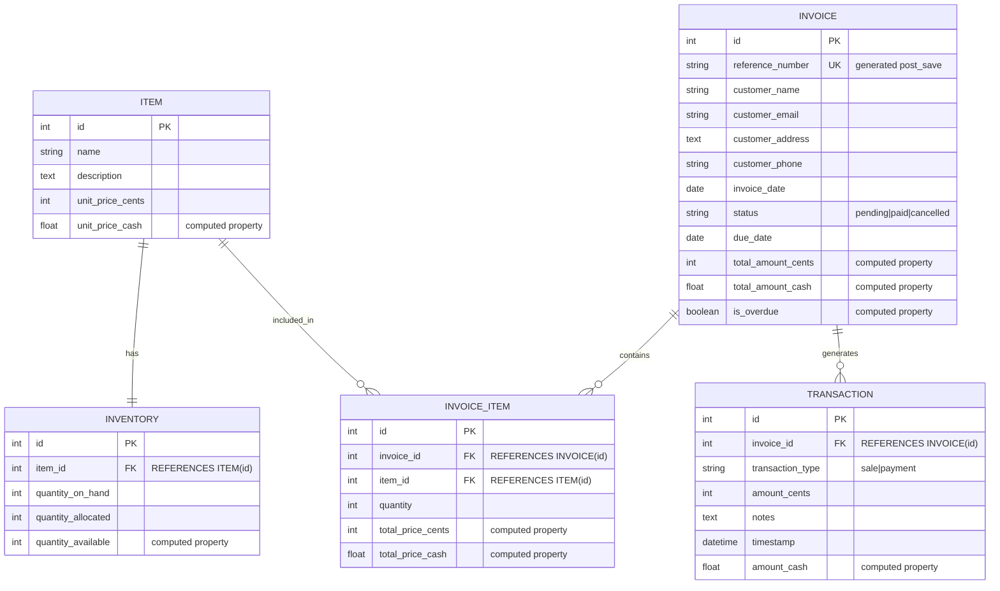

```mermaid
erDiagram
    ITEM ||--|| INVENTORY : has
    INVOICE ||--o{ INVOICE_ITEM : contains
    INVOICE ||--o{ TRANSACTION : generates
    ITEM ||--o{ INVOICE_ITEM : included_in
    
    ITEM {
        int id PK
        string name
        text description
        int unit_price_cents
        float unit_price_cash "computed property"
    }
    
    INVENTORY {
        int id PK
        int item_id FK "REFERENCES ITEM(id)"
        int quantity_on_hand
        int quantity_allocated
        int quantity_available "computed property"
    }
    
    INVOICE {
        int id PK
        string reference_number UK "generated post_save"
        string customer_name
        string customer_email
        text customer_address
        string customer_phone
        date invoice_date
        string status "pending|paid|cancelled"
        date due_date
        int total_amount_cents "computed property"
        float total_amount_cash "computed property"
        boolean is_overdue "computed property"
    }
    
    INVOICE_ITEM {
        int id PK
        int invoice_id FK "REFERENCES INVOICE(id)"
        int item_id FK "REFERENCES ITEM(id)"
        int quantity
        int total_price_cents "computed property"
        float total_price_cash "computed property"
    }
    
    TRANSACTION {
        int id PK
        int invoice_id FK "REFERENCES INVOICE(id)"
        string transaction_type "sale|payment"
        int amount_cents
        text notes
        datetime timestamp
        float amount_cash "computed property"
    }
```