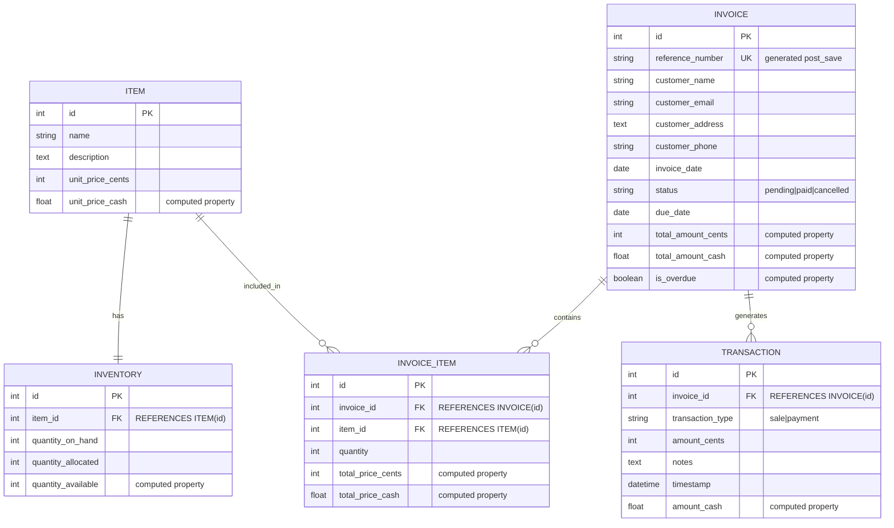

# Invoicing API Backend

This project implements a robust backend system for managing sales invoices and recording related transactions. It provides a RESTful API for creating, updating, viewing, paying, and cancelling invoices, with integrated inventory management and user authentication.

## Features

*   **Invoice Management:** Create, list, retrieve, update, pay, and cancel invoices.
*   **Item & Inventory:** Manage product items and their stock levels (on-hand, allocated, available).
*   **Transaction Tracking:** Automatically record 'Sale' transactions upon invoice creation and 'Payment' transactions upon invoice payment.
*   **Stock Allocation:** Implement a stock holding mechanism where items are allocated upon invoice creation and deducted upon payment.
*   **User Authentication:** Secure API endpoints using JWT (JSON Web Token) authentication, including user registration and token management.
*   **API Documentation:** Auto-generated interactive API documentation using Swagger UI and ReDoc.
*   **Containerized Deployment:** Production-ready setup using Docker and Docker Compose with Gunicorn and Nginx.

## Technologies Used

*   **Backend:** Python 3.12, Django 5.x, Django REST Framework 3.x
*   **Database:** PostgreSQL (recommended for production), SQLite (for development)
*   **Authentication:** `djangorestframework-simplejwt`
*   **API Documentation:** `drf-yasg`
*   **Package Management:** `uv`
*   **Deployment:** Docker, Docker Compose, Gunicorn, Nginx

## Entity-Relationship Diagram



## Key Architectural & Feature Decisions

This section explains the rationale behind some of the core design choices made in this project.

### 1. Granular Data Models (`Item`, `Inventory`, `InvoiceItem`, `Transaction`)

*   **`Item`**: Represents a distinct product or service. Separating `Item` from `InvoiceItem` allows for a centralized product catalog. An `Item` can exist independently of any invoice and can be reused across multiple invoices.
*   **`Inventory`**: Dedicated model to track the stock levels (`quantity_on_hand`, `quantity_allocated`) for each `Item`. This separation ensures that inventory management is a distinct concern from product definition.
*   **`InvoiceItem`**: This acts as a "through" model for the Many-to-Many relationship between `Invoice` and `Item`. It's crucial for storing the `quantity` of a specific `Item` included in a particular `Invoice`. Without it, we couldn't track how many of each item were sold on a given invoice.
*   **`Transaction`**: Provides an immutable audit trail of financial events. Instead of just changing an invoice's status, explicit 'Sale' and 'Payment' transactions are recorded. This offers a more robust accounting record and historical data.

### 2. Service Layer (`InvoiceService`)

*   **Decision**: Business logic for complex operations (invoice creation, payment processing, stock management) is encapsulated within a dedicated `InvoiceService` class.
*   **Rationale**: This adheres to the Single Responsibility Principle (SRP). Serializers focus solely on data validation and formatting, while views handle HTTP request/response. The service layer orchestrates multi-step business workflows, making the code more modular, reusable, and testable.

### 3. Stock Holding Mechanism (Allocated vs. On-Hand)

*   **Decision**: Implemented a stock allocation system using `quantity_on_hand` and `quantity_allocated` fields in the `Inventory` model.
*   **Rationale**: This prevents overselling. When an invoice is created, items are "allocated" (reserved) from the `quantity_on_hand`. The `quantity_available` for new sales is `on_hand - allocated`. Only upon payment are items fully deducted from `quantity_on_hand` and released from `quantity_allocated`. This ensures stock is reserved for pending orders.

### 4. JWT Authentication

*   **Decision**: Used `djangorestframework-simplejwt` for token-based authentication.
*   **Rationale**: JWT is a standard for stateless APIs. It provides a secure way for clients to authenticate without relying on server-side sessions, making the API scalable and suitable for mobile or single-page applications.

### 5. DRF Serializer Strategy (Read/Write Separation)

*   **Decision**: Employed different serializers for different API actions (e.g., `InvoiceListSerializer`, `InvoiceDetailSerializer`, `InvoiceCreateSerializer`, `InvoiceUpdateSerializer`).
*   **Rationale**: This allows tailoring the data representation precisely for each use case. Read serializers can be optimized for display, while write serializers focus on validation and input. This keeps payloads lean and validation strict.

### 6. DRF `ModelViewSet` and Custom Actions

*   **Decision**: Utilized `ModelViewSet` for standard CRUD operations and `@action` decorator for custom endpoints like `pay` and `cancel`.
*   **Rationale**: `ModelViewSet` provides a quick and consistent way to build RESTful APIs. Custom actions allow extending the API with specific business operations that don't fit the standard CRUD model, keeping related functionality grouped within the same viewset.

### 7. `drf-yasg` for API Documentation

*   **Decision**: Integrated `drf-yasg` for automatic API documentation.
*   **Rationale**: Provides interactive Swagger UI and ReDoc interfaces directly from the codebase. This makes the API easy to explore, understand, and test for developers, significantly improving developer experience. Explicit annotations (`@swagger_auto_schema`) were added for clarity.

### 8. Docker and Docker Compose for Deployment

*   **Decision**: Containerized the application using Docker and orchestrated with Docker Compose.
*   **Rationale**: Ensures consistent development and production environments, simplifies dependency management, and provides a portable deployment unit. Gunicorn serves the Django application, and Nginx acts as a reverse proxy, serving static files and handling rate limiting.

### 9. No Saga Orchestrator Pattern

*   **Decision**: Did not implement the Saga Orchestrator pattern.
*   **Rationale**: The Saga pattern is designed for managing transactions across *distributed systems* (microservices) where a single database transaction is not possible. This project is a monolithic application with a single database. Django's `django.db.transaction.atomic()` provides full ACID (Atomicity, Consistency, Isolation, Durability) guarantees for all multi-step operations within this single database, making the complex Saga pattern unnecessary and overkill.

## Setup Instructions (Development)

Follow these steps to get the project up and running on your local machine for development and testing.

### Prerequisites

*   Python 3.12+
*   `uv` (recommended package manager)
*   Docker and Docker Compose (for production-like local testing)

### 1. Clone the Repository

```bash
git clone https://github.com/kaziiriad/invoicing_application.git
cd invoicing_application/
```

### 2. Install Dependencies

Using `uv` (ensure `uv` is installed globally or via `pip install uv`):

```bash
uv sync
```

### 3. Environment Variables

Create a `.env` file in the `backend/` directory based on `backend/.env.template`:

```bash
cp backend/.env.template backend/.env
```

Edit `backend/.env` and fill in your `SECRET_KEY` and `DATABASE_URL`. For local development, you can use SQLite:

```
SECRET_KEY=your_secret_key_here
DEBUG=True
ALLOWED_HOSTS=localhost,127.0.0.1
DATABASE_URL=sqlite:///db.sqlite3 # For local setup only. Use posgreSQL for production environment
```

### 4. Database Setup

Apply migrations to create the database schema:

```bash
uv run -- python backend/manage.py makemigrations users invoicing
uv run -- python backend/manage.py migrate
```

### 5. Create a Superuser (for Admin Panel Access)

```bash
uv run -- python backend/manage.py createsuperuser
```

### 6. Seed Initial Data

Populate the database with some sample items and inventory:

```bash
uv run -- python backend/manage.py seed_inventory
```

### 7. Run the Development Server

```bash
uv run -- python backend/manage.py runserver
```

The API will be accessible at `http://127.0.0.1:8000/api/`.

## API Endpoints

All API endpoints are prefixed with `/api/`.

### Authentication

*   **`POST /api/users/register/`**: Register a new user.
    *   **Request Body:** `{"username": "...", "email": "...", "password": "...", "password2": "..."}`
    *   **Response:** User data, `access` and `refresh` JWT tokens.
*   **`POST /api/token/`**: Obtain JWT access and refresh tokens.
    *   **Request Body:** `{"username": "...", "password": "..."}`
    *   **Response:** `access` and `refresh` JWT tokens.
*   **`POST /api/token/refresh/`**: Refresh an expired access token using a refresh token.
    *   **Request Body:** `{"refresh": "..."}`
    *   **Response:** New `access` token.
*   **`POST /api/users/logout/`**: Blacklist a refresh token to log out.
    *   **Request Body:** `{"refresh": "..."}`
    *   **Response:** `205 Reset Content` on success.

### Invoices (Requires Authentication)

*   **`GET /api/invoices/`**: List all invoices.
*   **`POST /api/invoices/`**: Create a new invoice.
    *   **Request Body:** `{"customer_name": "...", "due_date": "YYYY-MM-DD", "items": [{"item": <item_id>, "quantity": <int>}]}`
*   **`GET /api/invoices/{id}/`**: Retrieve details of a specific invoice.
*   **`PATCH /api/invoices/{id}/`**: Partially update a pending invoice (e.g., customer details, due date).
*   **`PUT /api/invoices/{id}/`**: Fully update a pending invoice (e.g., customer details, due date).
*   **`POST /api/invoices/{id}/pay/`**: Mark a pending invoice as paid.
    *   **Request Body (Optional):** `{"notes": "..."}`
*   **`POST /api/invoices/{id}/cancel/`**: Cancel a pending invoice and release allocated stock.

### API Documentation

Access the interactive API documentation at:
*   **Swagger UI:** `http://127.0.0.1:8000/swagger/`
*   **ReDoc:** `http://127.0.0.1:8000/redoc/`

## Deployment (Production with Docker Compose)

For a production environment, it's recommended to use Docker Compose to run your application with Gunicorn and Nginx.

### Prerequisites

*   Docker and Docker Compose installed.

### 1. Environment Variables

Ensure your `backend/.env` file is configured for production:

```
SECRET_KEY=your_production_secret_key_here
DEBUG=False
ALLOWED_HOSTS=your_domain.com,www.your_domain.com
DATABASE_URL=postgres://user:password@db:5432/dbname # Replace with your PostgreSQL connection string
```

### 2. Build and Run

From the project root directory, execute:

```bash
docker-compose up --build -d
```

*   `--build`: Rebuilds the Docker images (necessary after code changes).
*   `-d`: Runs the containers in detached mode (in the background).

### 3. Access

Your application will be accessible on port 80 of your host machine.

*   **API:** `http://your_host_ip_or_domain/api/`
*   **Swagger UI:** `http://your_host_ip_or_domain/swagger/`
*   **ReDoc:** `http://your_host_ip_or_domain/redoc/`

---

This `README.md` provides a comprehensive overview, setup instructions, API details, and justifications for key design decisions.
